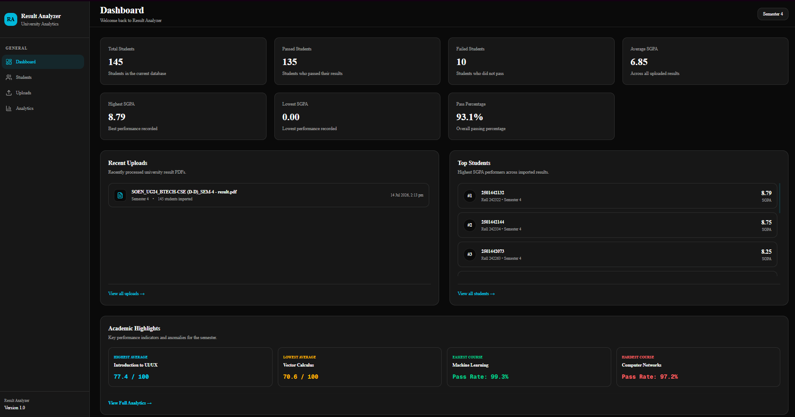
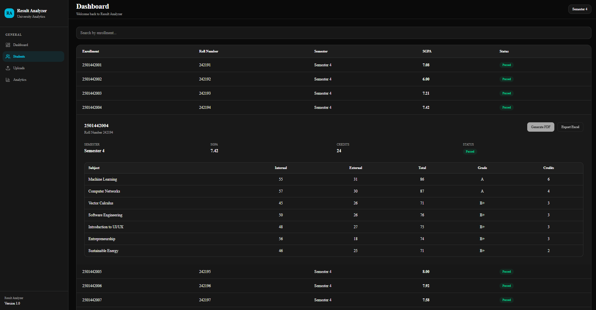
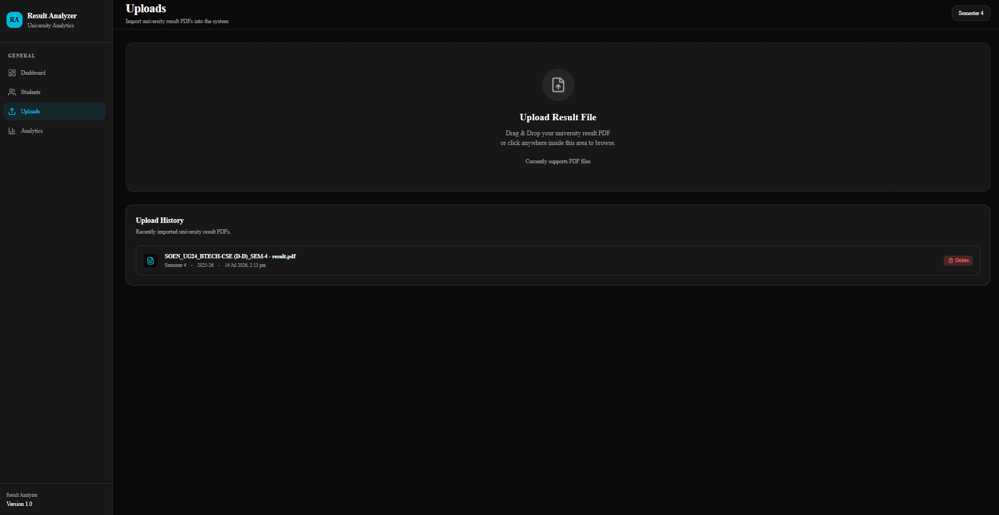
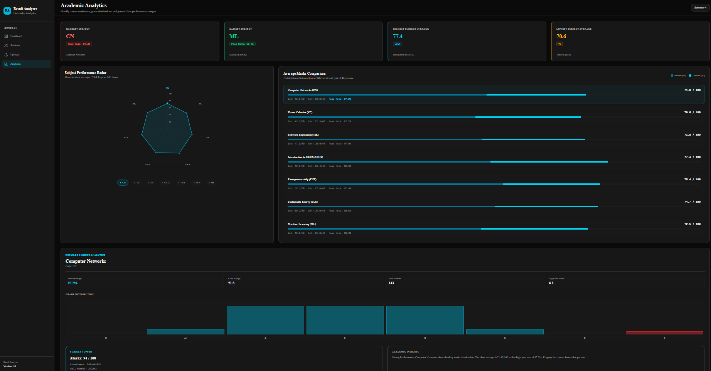

# 📊 Result Analyzer

A full-stack academic analytics platform that converts university semester result PDFs into a searchable database and interactive dashboard.

The application automatically extracts students, subjects, grades, SGPA, credits, and pass/fail information from official university result sheets, stores them in PostgreSQL, and visualizes class performance through modern analytics.

---

# 🌐 Live Demo

### Application

https://result-analyzer-flax.vercel.app

### Backend API

https://result-analyzer-api-fiwj.onrender.com

> **Note**
>
> The backend is hosted on Render's free tier. The first request after a period of inactivity may take **30–60 seconds** while the server wakes up.

---

# ✨ Features

## 📥 Result Processing

- Upload official university result PDF
- Automatic PDF parsing
- Student extraction
- Subject extraction
- SGPA calculation
- Credit calculation
- Grade point calculation
- Automatic pass/fail detection
- Duplicate student prevention (Upsert)

---

## 👨‍🎓 Student Management

- Student directory
- Enrollment search
- Expandable student result cards
- Subject-wise mark breakdown
- Latest result retrieval

---

## 📈 Analytics Dashboard

- Dashboard overview
- Total students
- Pass percentage
- Average / Highest / Lowest SGPA
- Recent uploads
- Top 10 students
- Subject performance radar chart
- Subject comparison chart
- Grade distribution analysis
- Subject topper detection
- Hardest subject detection
- Easiest subject detection
- Highest subject average
- Lowest subject average
- Detailed subject breakdown

---

## ⚙️ Backend

- RESTful API
- PostgreSQL integration
- Prisma ORM
- Relational database design
- Upload history
- Statistics aggregation
- Topper calculation

---

# 📷 Screenshots

## Dashboard



---

## Student Directory



---

## Upload Management



---

## Academic Analytics



---

# 🚀 Quick Start

## Clone the repository

```bash
git clone https://github.com/AkihitoriBara/result-analyzer.git
```

## Install dependencies

Backend

```bash
cd server
npm install
```

Frontend

```bash
cd ../client
npm install
```

## Configure environment variables

Copy the example environment files.

Backend

```bash
cp .env.example .env
```

Frontend

```bash
cp .env.example .env.local
```

Update the values as required.

## Start the application

Backend

```bash
npm run dev
```

Frontend

```bash
npm run dev
```

Open

```
http://localhost:3000
```

---

# 🧪 Testing the Application

A sample university result PDF is provided for testing.

Location

```text
docs/sample-data/semester4-results.pdf
```

### Test Workflow

1. Open the Upload page.
2. Upload the sample PDF.
3. Wait for processing to finish.
4. Visit the Dashboard.
5. Explore the Student Directory.
6. View the Academic Analytics page.
7. Delete the uploaded file to verify database cleanup.

---

# 🛠 Tech Stack

## Frontend

- Next.js (App Router)
- React
- TypeScript
- Tailwind CSS
- shadcn/ui

## Backend

- Express
- TypeScript
- Prisma ORM
- Prisma Client
- PostgreSQL
- Multer
- pdf2json

---

# ☁️ Deployment

| Service | Platform |
|----------|----------|
| Frontend | Vercel |
| Backend | Render |
| Database | Neon PostgreSQL |

---

# 🏗 Architecture

```text
                 University Result PDF
                          │
                          ▼
                  Express API (Backend)
                          │
               PDF Parsing (pdf2json)
                          │
                          ▼
                    Prisma ORM
                          │
                          ▼
               PostgreSQL (Neon)
                          │
                          ▼
                 REST API Endpoints
                          │
                          ▼
         Next.js Dashboard (Frontend)
```

---

# 📂 Project Structure

```text
result-analyzer/

├── client/
│   ├── public/
│   ├── src/
│   │   ├── app/
│   │   ├── components/
│   │   ├── services/
│   │   ├── lib/
│   │   └── types/
│   └── package.json
│
├── server/
│   ├── prisma/
│   ├── src/
│   │   ├── controllers/
│   │   ├── services/
│   │   ├── parser/
│   │   ├── database/
│   │   ├── routes/
│   │   └── middleware/
│   └── package.json
│
├── docs/
└── README.md
```

---

# 🌐 REST API

## Uploads

| Method | Endpoint |
|---------|----------|
| POST | `/api/upload` |
| GET | `/api/uploads` |

---

## Students

| Method | Endpoint |
|---------|----------|
| GET | `/api/students` |
| GET | `/api/students/:enrollment` |
| GET | `/api/students/search?enrollment=...` |

---

## Results

| Method | Endpoint |
|---------|----------|
| GET | `/api/results/topper` |
| GET | `/api/results/top10` |

---

## Statistics

| Method | Endpoint |
|---------|----------|
| GET | `/api/statistics` |

---

# 🗄 Database

Current tables

- Student
- Result
- SubjectResult
- Upload
- PassCriteria

Relationships

```text
Student
 └── Result
      └── SubjectResult

Upload
 └── Result

PassCriteria
 └── Upload
```

---

# ⚙️ Environment Variables

## Frontend

Create `client/.env.local` using `client/.env.example`.

```env
NEXT_PUBLIC_API_URL=http://localhost:5000/api
```

| Variable | Description |
|----------|-------------|
| `NEXT_PUBLIC_API_URL` | Base URL of the backend API |

---

## Backend

Create `server/.env` using `server/.env.example`.

```env
PORT=5000
DATABASE_URL=
JWT_SECRET=your-secret-here
NODE_ENV=development
```

| Variable | Description |
|----------|-------------|
| `PORT` | Server port |
| `DATABASE_URL` | PostgreSQL connection string |
| `JWT_SECRET` | JWT signing secret |
| `NODE_ENV` | Application environment |

### Local Setup

Create the following files before running the project:

```text
client/.env.local
server/.env
```

using the provided `.env.example` templates, then update the values to match your local environment.

---

# ⚠️ Known Limitations (Version 1)

Version 1 focuses on demonstrating the complete workflow from PDF upload to academic analytics.

Current limitations include:

- Supports the official JG University Semester 4 result PDF format.
- Upload progress reflects file transfer but not backend parsing progress.
- Backend is hosted on Render's free tier and may require up to one minute to wake after inactivity.
- Large PDF imports require several seconds before analytics become available.
- Authentication and multi-user support are planned for Version 2.

---

# 🚀 Current Progress

Backend ██████████ 100%

Frontend ██████████ 100%

Analytics ██████████ 100%

Deployment ██████████ 100%

Version 1.0 ██████████ 100%

---

# 🛣 Roadmap

## ✅ Version 1.0 (Current)

- PDF Upload
- PDF Parsing
- Student Extraction
- Subject Extraction
- PostgreSQL Integration
- Dashboard
- Student Directory
- Academic Analytics
- Radar Chart
- Subject Comparison
- Top Students
- Upload History

---

## 🚧 Version 2

- Authentication
- Multi-semester support
- Semester comparison
- Advanced filtering
- Export reports
- PDF report generation

---

## 🔮 Version 3

- AI-powered insights
- Faculty dashboard
- Department analytics
- Multi-user support
- Role-based permissions

---

# 💡 Future Improvements

- Support multiple university result formats
- Background PDF processing with job queues
- Accurate real-time upload progress
- Semester-to-semester comparisons
- PDF and Excel report exports
- Performance optimization for larger datasets
- Docker support
- Improved caching and loading performance

---

# 🎯 Project Goal

Result Analyzer aims to automate the manual process of analyzing university examination results by transforming official PDF result sheets into structured relational data that can be searched, analyzed, and visualized through an interactive academic dashboard.

---

# 📚 What I Learned

Building this project gave me practical experience in:

- Designing a full-stack application architecture
- Building REST APIs with Express
- Working with Prisma ORM and PostgreSQL
- Parsing structured PDF documents
- Designing relational database schemas
- Building reusable React components
- State management in Next.js
- Deploying production applications using Vercel, Render, and Neon
- Managing environment variables for local and production environments
- Structuring large TypeScript codebases
- Building complete end-to-end software projects

---

# 📖 Additional Documentation

- `docs/DEVELOPMENT_LOG.md` — Major bugs encountered and how they were resolved.
- `docs/sample-data/semester4-results.pdf` — Sample input for testing the application.